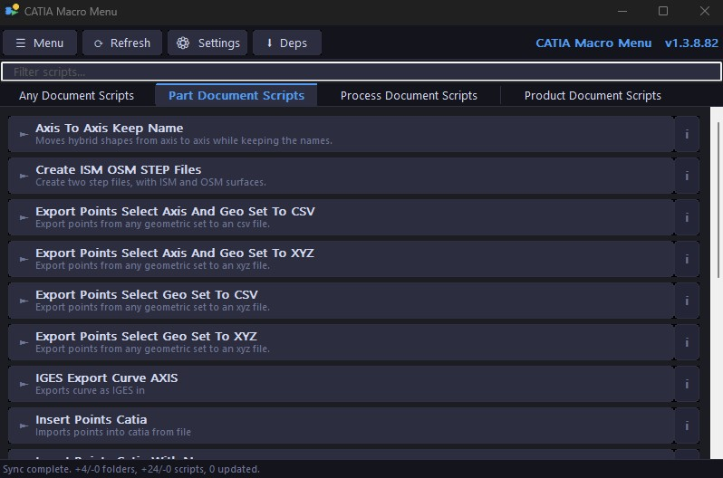
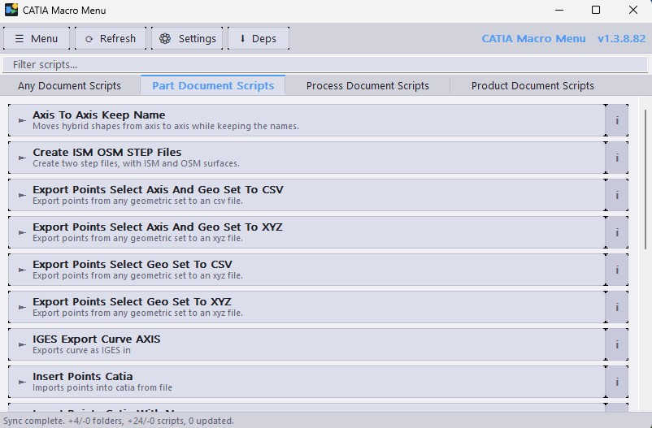

# CatiaMenuWin32

A lightweight, native **Win32 API / C** Python script launcher and manager
— built for PyCATIA and CATIA V5 automation, but works as a general-purpose launcher for any Python scripts or application macros. Direct Win32 API, no frameworks, pure C11.

## 📚 Documentation

Full documentation is available in the [`docs/`](docs/) folder:

- [User Guide](docs/user-guide.md) — installation, settings, sources, running scripts
- [FAQ](docs/faq.md) — common questions about installation, sync, scripts, and configuration
- [Developer Guide](docs/developer-guide.md) — building from source, project structure, releasing
- [File Reference](docs/file-reference.md) — source files, structs, functions, constants
- [Changelog](docs/changelog.md) — release history

---

## 📸 Screenshots

**Dark Mode**


**Light Mode**


---

## 🎯 What It Does

CatiaMenuWin32 syncs Python scripts from GitHub and presents them as clickable buttons organised into tabs. Click a button — the script runs. No macro editor, no manual path setup, no copy-pasting.

While it ships with the [KaiUR/Pycatia_Scripts](https://github.com/KaiUR/Pycatia_Scripts) repository as its built-in source — scripts that automate CATIA V5 via the [PyCATIA](https://github.com/evereux/pycatia) library — the built-in source can be disabled entirely. You can point the app at any GitHub repository or local folder containing `.py` files, making it a general-purpose Python script launcher for any workflow, tool, or application that exposes a Python API.

## 📂 Script Tabs

Tabs are built dynamically from the folders in `KaiUR/Pycatia_Scripts`. If folders are
added or removed from the repo, tabs update automatically on the next sync:

| Tab | Folder |
|-----|--------|
| Any Document Scripts | `Any_Document_Scripts/` |
| Part Document Scripts | `Part_Document_Scripts/` |
| Process Document Scripts | `Process_Document_Scripts/` |
| Product Document Scripts | `Product_Document_Scripts/` |

## 🚀 Features

| Feature | Detail |
|---------|--------|
| **Live GitHub sync** | Fetches repo structure and compares SHA hashes — only downloads changed files |
| **Offline cache** | Scripts load from local cache immediately on startup — works without internet |
| **Dynamic tabs** | Folder additions/removals detected automatically; no recompile needed |
| **Script info tooltip** | Hover over the `i` badge on any button to see Purpose, Author, Version, Date, and full Description parsed from the script header |
| **Certificate validation** | Every HTTPS connection validates the server certificate subject and issuer — blocks MITM attacks |
| **SHA verification** | Every script is verified against its GitHub blob SHA before running — detects tampered files |
| **Single instance** | Only one instance runs at a time — launching a second brings the existing window to the front |
| **Favourites tab** | Right-click any script to favourite it; a ⭐ Favourites tab appears automatically |
| **Search/filter** | Real-time filter bar filters scripts by name or purpose |
| **Script details** | Right-click → Script Details shows all header fields, notes, favourite/hidden controls |
| **Hide scripts** | Right-click → Hide Script; restore via Menu → File → Manage Hidden Scripts |
| **Sort scripts** | Sort by Default, Alphabetical, By Date, or Most Used |
| **Run with arguments** | Right-click → Run with Arguments to pass custom CLI arguments |
| **Stop running script** | ■ Stop toolbar button terminates a running background script instantly via `TerminateProcess` |
| **Script notes** | Per-script user notes stored locally in `prefs.ini` |
| **Auto-refresh** | Background sync every N hours (default 6); configurable in Settings |
| **Auto-update** | Optionally download and install new versions automatically |
| **AppData settings** | All settings in `%APPDATA%\CatiaMenuWin32\settings.ini` |
| **Quick Launch Bar** | Floating button bar sourced from your Favourites tab — large icon buttons, drag anywhere, scroll arrows, hover tooltips, always-on-top with the target app |
| **Target app tracking** | Bar hides when the target app is not open or all its windows are minimised; shows only when a visible target window exists; rises to TOPMOST when the target app gains focus — configurable via right-click → Set Target App… or Settings → Quick Bar |
| **Always on Top** | Window stays above CATIA so you can click scripts without alt-tabbing |
| **System Tray** | Minimize to tray; restore with double-click |
| **Start with Windows** | Autorun via registry with optional start-minimized flag |
| **Update checker** | Checks GitHub Releases on startup and notifies if a newer version is available |
| **Update Dependencies** | Runs `setup/update.bat` or falls back to `pip install -r requirements.txt` |
| **Dark / Light / System theme** | Follows Windows theme by default; toggle via Menu → View → Theme |
| **Auto-versioning** | CMake increments `build_number.txt` on every configure; CI appends it to the release tag |

## 📁 Script Sources

CatiaMenuWin32 can load scripts from multiple sources simultaneously — the built-in repository, additional GitHub repositories, and local folders on your machine. Open **Menu → File → Sources...** to manage them.

### Built-in Repository

The `KaiUR/Pycatia_Scripts` repository is always the primary source. It can be disabled in the Sources dialog if you only want to use your own scripts.

### Additional GitHub Repositories

Add any public (or private, with a token) GitHub repository that follows the same folder structure:
- Subfolders of the repo root become tabs
- `.py` files inside subfolders become script buttons
- If two repositories have a subfolder with the same name, their scripts are merged into one tab
- Each repo can have its own branch and optional Personal Access Token
- All connections go through the same certificate validation and SHA verification as the built-in repo

**To add a repository:**
1. Open **Menu → File → Sources...**
2. Click **Add...** under "Additional GitHub Repositories"
3. Enter the full GitHub URL: `https://github.com/owner/repo`
4. Enter the branch name (defaults to `main`)
5. Optionally add a Personal Access Token for private repos or higher rate limits
6. Click OK

### Local Script Folders

Add a folder on your local machine. The folder structure mirrors the GitHub repo structure:
- Subfolders of the selected folder become tabs
- `.py` files inside subfolders become script buttons
- Local scripts are not downloaded or SHA-checked — they run directly from disk
- If a local subfolder has the same name as a tab from GitHub, the scripts are merged

**To add a local folder:**
1. Open **Menu → File → Sources...**
2. Click **Add...** under "Local Script Folders"
3. Browse to your folder
4. Click OK

**Example folder structure:**
```
My_Scripts/
├── Any_Document_Scripts/
│   ├── my_custom_script.py
│   └── another_script.py
└── Part_Document_Scripts/
    └── part_tool.py
```

This would add "My Custom Script" and "Another Script" to the "Any Document Scripts" tab alongside the built-in scripts.

### Tab Scrolling

When more tabs exist than can fit in the window width, left (◄) and right (►) arrow buttons appear at the edges of the tab bar. You can also scroll through tabs by hovering over the tab bar and using the **mouse wheel**.

## 🔒 Security

All communication with GitHub is secured at two levels:

**Certificate validation** — every HTTPS request (API and raw downloads) validates that the server certificate subject contains `github.com` or `github.io` and the issuer is a known CA (DigiCert, Sectigo, GlobalSign, or Let's Encrypt). Connections that fail this check are aborted before any data is read.

**SHA verification** — before any script is executed, its local file SHA is computed using Git's blob SHA format (`SHA1("blob <size>\0<content>")`) and compared against the SHA returned by the GitHub API. If they don't match, a warning is shown and the script is blocked until re-downloaded and verified.

## 🛠️ Built With

- **Language**: C (C11)
- **API**: Win32 API — User32, GDI32, ComCtl32, WinINet, Shell32, Shlwapi, DwmApi, Crypt32
- **Build system**: CMake 3.16+ / Ninja
- **Compiler**: LLVM/Clang (with MSVC Windows SDK)
- **Code signing**: PowerShell + `signtool.exe` — release binaries are Authenticode-signed
- **AI Assistance**: Claude (Anthropic) — used to assist with code generation, debugging, and architecture decisions
- **PyCATIA**: Scripts use the [PyCATIA](https://github.com/evereux/pycatia) library by evereux for CATIA V5 automation

## 📦 Building from Source

### Prerequisites
- [LLVM](https://releases.llvm.org/) — Clang 17+
- [Visual Studio](https://visualstudio.microsoft.com/) 2019+ (for Windows SDK and `rc.exe`)
- [CMake 3.16+](https://cmake.org/)
- [Ninja](https://ninja-build.org/)
- Qt Creator (optional, used as IDE)

### Runtime Requirements (for running scripts)
- **Python 3.9+** — required to execute PyCATIA scripts
- **[PyCATIA](https://github.com/evereux/pycatia)** — install via `pip install pycatia`
- **CATIA V5** — must be running for scripts that interact with it

### Steps

Open a **Developer Command Prompt for VS**, then:

```bash
git clone https://github.com/KaiUR/CatiaMenuWin32
cd CatiaMenuWin32
cmake -S . -B build -G "Ninja" -DCMAKE_BUILD_TYPE=Release -DCMAKE_C_COMPILER=clang-cl
cmake --build build
```

### Qt Creator

1. Open `CMakeLists.txt` in Qt Creator
2. Select a Clang kit configured with the MSVC toolchain
3. Build → Build All

Local builds automatically detect the latest git tag for the version number and show a `(local)` suffix. The update checker is disabled for local builds.

## ⚙️ Settings (`%APPDATA%\CatiaMenuWin32\settings.ini`)

All settings are configurable in the **⚙ Settings** dialog (five tabs: General, Sync, Console, Window, Quick Bar).

| Setting | Default | Description |
|---------|---------|-------------|
| `Python\Executable` | auto-detect | Full path to `python.exe` |
| `Scripts\CacheDir` | `%APPDATA%\CatiaMenuWin32\scripts` | Local script cache |
| `GitHub\Token` | empty | Optional PAT — raises API rate limit from 60 to 5000 req/hr |
| `Options\AutoSync` | on | Sync scripts from GitHub on startup |
| `Options\DownloadBeforeRun` | off | Always fetch latest before running |
| `Options\ShowConsole` | off | Show Python console window when running a script |
| `Options\ConsoleKeepOpen` | on | Keep console open after script finishes so you can read errors |
| `Options\DepsKeepOpen` | off | Keep Update Deps console open until manually closed |
| `Options\CheckUpdates` | on | Check GitHub Releases for a newer app version on startup |
| `Options\AutoUpdate` | on | Download and install new versions automatically |
| `Options\RefreshInterval` | 6 | Background sync interval in hours (0 = disabled) |
| `Options\SortMode` | 0 (Default) | 0 = default order, 1 = alphabetical, 2 = by date, 3 = most used |
| `Window\AlwaysOnTop` | on | Keep window above other windows |
| `Window\MinimizeToTray` | off | Hide to system tray on minimize/close |
| `Window\StartWithWindows` | on | Add to Windows autorun registry key |
| `Window\StartMinimized` | on | Start hidden/minimized |
| `Window\Theme` | 0 (System) | 0 = follow Windows, 1 = dark, 2 = light |
| `QuickBar\Enabled` | on | Show the Quick Launch Bar |
| `QuickBar\Horizontal` | off | Bar orientation: 0 = vertical, 1 = horizontal |
| `QuickBar\TopmostWithCatia` | on | Rise to TOPMOST when the target app is in the foreground |
| `QuickBar\TargetApp` | `CATIA V5` | Window-title substring to track; empty = always visible, no topmost |
| `QuickBar\TargetExe` | `CNEXT.exe` | Process executable name to match alongside TargetApp; empty = any process |
| `QuickBar\X` / `QuickBar\Y` | auto | Saved position of the floating bar |

## 🔑 GitHub Token (optional)

The app uses the GitHub REST API to fetch the script list. Without a token, GitHub allows 60 requests per hour per IP — usually plenty. If you hit the limit, add a **Personal Access Token**:

1. Go to GitHub → Settings → Developer settings → Personal access tokens → Fine-grained tokens
2. Create a token with **read-only** access to public repositories
3. Paste it in **Menu → Settings → Use token**

The token is stored in `settings.ini` and sent as an `Authorization: token` header. It is never transmitted anywhere except `api.github.com` and `raw.githubusercontent.com`.

> **Office / shared network users:** GitHub's unauthenticated API limit is 60 requests per hour per public IP address. If multiple people in your organisation use CatiaMenuWin32 on the same network, you may occasionally see a "Connect to internet to sync" message even with a working internet connection. This is the rate limit being hit, not a connectivity issue. Each user should add a Personal Access Token in **Menu → Settings → Use token** to raise their individual limit to 5000 requests per hour.

## 🖥️ Console Window Options

When **Show Python console window** is enabled:
- A console window opens when a script runs
- **Keep console open after script finishes** — wraps the command as `cmd.exe /k python script.py` so the window stays open after the script exits, letting you read any errors or print output

Without **Show console window**, scripts run silently in the background and the status bar shows the exit code.

## 🔄 Update Dependencies

The **Update Deps** button runs `setup/update.bat` from the cached scripts folder. If that file doesn't exist, it falls back to `pip install -r setup/requirements.txt` using your configured Python interpreter. Enable **Keep Update Deps console open** in Settings to keep the window visible until you close it.

## 🔢 Versioning System

- `build_number.txt` auto-increments on every `cmake` configure (local and CI)
- CMake reads the latest git tag automatically for local builds — no manual version editing needed
- The workflow reads the tag you push (e.g. `v1.1.0`), builds with that version, then appends the build number to create the final release tag (e.g. `v1.1.0.21`)
- The binary version and release tag always match

## 🚀 How to Release

```bash
git tag v1.2.0
git push origin v1.2.0
```

GitHub Actions builds, increments the build number, and publishes automatically. The final tag becomes `v1.2.0.<buildnum>`.

## 📄 License

MIT License — Copyright © 2026 Kai-Uwe Rathjen

Developed with AI assistance from Claude (Anthropic).

---

**Author**: [Kai-Uwe Rathjen](https://github.com/KaiUR)
