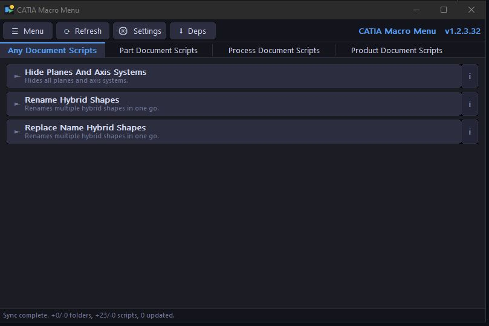
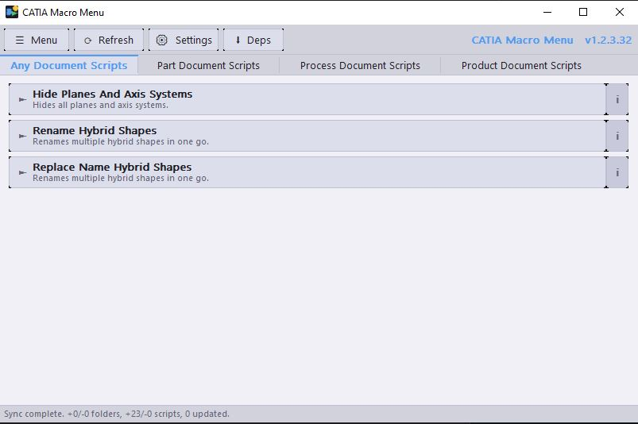

# CatiaMenuWin32

A lightweight, native Win32/C macro launcher for PyCATIA scripts used with CATIA V5.

## Documentation

- [Full Overview](about)
- [User Guide](user-guide) — installation, settings, sources, running scripts
- [Developer Guide](developer-guide) — building from source, project structure, releasing
- [File Reference](file-reference) — source files, structs, functions, constants
- [Changelog](changelog) — release history

## Quick Links

- [Download Latest Release](https://github.com/KaiUR/CatiaMenuWin32/releases/latest)
- [GitHub Repository](https://github.com/KaiUR/CatiaMenuWin32)
- [Script Repository](https://github.com/KaiUR/Pycatia_Scripts)
- [Report an Issue](https://github.com/KaiUR/CatiaMenuWin32/issues)
- [PyCATIA](https://github.com/evereux/pycatia)

## Screenshots

**Dark Mode**

**Light Mode**

## About

CatiaMenuWin32 connects directly to the [KaiUR/Pycatia_Scripts](https://github.com/KaiUR/Pycatia_Scripts) repository and presents every script as a clickable button. Click a button — the script runs. No CATIA macro editor, no manual path setup, no copy-pasting.

Scripts use the [PyCATIA](https://github.com/evereux/pycatia) library for CATIA V5 COM automation.

**Requirements:** Python 3.9+, PyCATIA, CATIA V5

**Author:** [Kai-Uwe Rathjen](https://github.com/KaiUR) — MIT License
