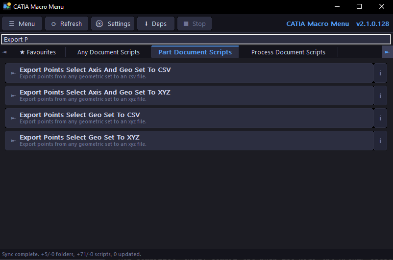
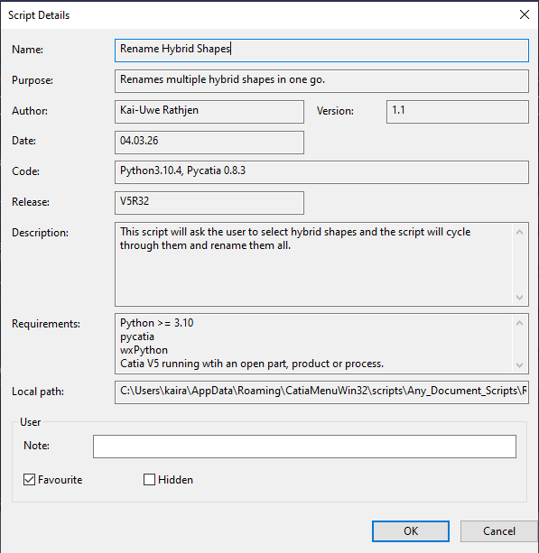
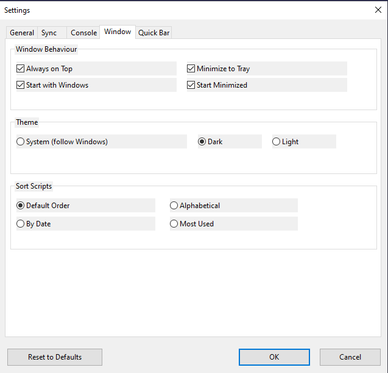
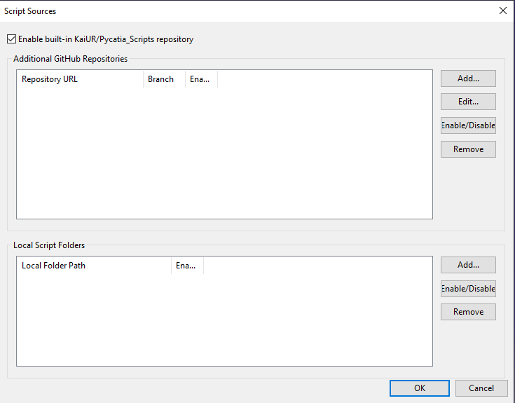

# CatiaMenuWin32

**Stop copy-pasting scripts. Click a button.**

CatiaMenuWin32 is a fast, native Windows application that syncs Python scripts directly from GitHub and presents them as one-click buttons — organised by tab, always up to date, always ready to run.

Built primarily for CATIA V5 engineers running PyCATIA automation scripts, but equally useful as a general-purpose Python script launcher or macro manager for any application that exposes a Python API. Point it at any GitHub repository or local folder of `.py` files and it works the same way.

<a href="https://github.com/KaiUR/CatiaMenuWin32/releases/latest" class="btn"><svg xmlns="http://www.w3.org/2000/svg" width="18" height="18" viewBox="0 0 25 25" style="vertical-align:middle;margin-right:6px"><path fill="#f35325" d="M0 0h11.5v11.5H0z"/><path fill="#81bc06" d="M13 0h12v11.5H13z"/><path fill="#05a6f0" d="M0 13h11.5V25H0z"/><path fill="#ffba08" d="M13 13h12V25H13z"/></svg>Download for Windows 10/11</a> &nbsp; [View on GitHub](https://github.com/KaiUR/CatiaMenuWin32){: .btn}

---

## What It Does

- **Syncs scripts from GitHub** — connects to [KaiUR/Pycatia_Scripts](https://github.com/KaiUR/Pycatia_Scripts) on startup and keeps your local cache up to date
- **One click to run** — every script is a button; click it and Python runs the script immediately
- **No setup per script** — no manual path configuration, no copy-pasting, no CATIA macro editor
- **Works offline** — scripts load from local cache immediately even without an internet connection
- **Add your own sources** — connect additional GitHub repositories or local folders alongside the built-in scripts
- **Quick Launch Bar** — floating button bar sourced from your Favourites; stays above CATIA and hides when CATIA is not open. Show or hide it from any application with a configurable hotkey (`Ctrl+Shift+Q`)
- **Find anything fast** — press **Ctrl+K** (even from inside CATIA) to open the command palette, type part of a script name and press Enter
- **See what changed** — new and updated scripts are marked with a dot, and the tooltip shows each script's latest change
- **Secure** — every HTTPS connection validates the server certificate; every script is SHA-verified before running; updates install only if signed by the same publisher

---

## Documentation

- [User Guide](user-guide) — installation, settings, sources, running scripts, favourites, search, hiding scripts
- [FAQ](faq) — common questions about installation, sync, scripts, and configuration
- [Developer Guide](developer-guide) — building from source, project structure, releasing
- [File Reference](file-reference) — source files, structs, functions, constants
- [Changelog](changelog) — release history
- [Contributing](https://github.com/KaiUR/CatiaMenuWin32/blob/main/CONTRIBUTING.md)
- [Privacy Policy](privacy-policy)

---

## Screenshots

**Dark Mode**

**Light Mode**

**Quick Launch Bar**

 

**Search / Filter**

**Script Details**

**Settings**

**Script Sources**

---

## Key Features

| Feature | Detail |
|---------|--------|
| Live GitHub sync | One Git Trees API request lists each repository; an unchanged repository answers "not modified" and the cached listing is reused. Only changed files are downloaded, and scripts deleted from the repository are removed from the cache |
| Offline cache | Scripts load from disk immediately on startup — works without internet |
| Dynamic tabs | Folder additions and removals in the repo are detected automatically; no recompile needed |
| Search/filter | Real-time filter bar — find scripts by name or purpose instantly |
| Favourites tab | Star any script; a dedicated Favourites tab appears automatically |
| Quick Launch Bar | Floating button bar sourced from your Favourites — drag anywhere, always on top, hides when target app is not open |
| Target app tracking | Bar rises to topmost when CATIA gains focus; hides when CATIA is closed or minimised |
| Quick Bar hotkey | System-wide hotkey toggles the bar from any application — default `Ctrl+Shift+Q`, fully configurable |
| Script details | Right-click any script to see full header info and change history, add notes, hide, or favourite |
| Script info tooltip | Hover the `i` badge on any button to see Purpose, Author, Version, Date, Description and the latest change |
| New & updated badges | A green dot marks new scripts and a blue dot updated ones (tabs get a dot too); cleared when you run the script or open its details, or via View → Mark All Scripts as Seen |
| Command palette | **Ctrl+K** opens a search box over every script — type letters in order, Enter runs, Shift+Enter runs with arguments, Ctrl+Enter shows details. System-wide by default, so it works from inside CATIA |
| Script notes | Per-script user notes stored locally |
| Hide scripts | Right-click → Hide Script; restore via Menu → File → Manage Hidden Scripts |
| Sort scripts | Sort by Default, Alphabetical, By Date, or Most Used |
| Run with arguments | Right-click → Run with Arguments to pass custom CLI arguments; logged and stoppable like a normal run |
| Script parameter form | Scripts that declare an `Args:` header get a Run with Arguments form — text boxes, checkboxes and drop-downs — with the last values remembered per script |
| Dependency check | Packages in a script's `dependencies = [...]` list are checked against the Python interpreter before it runs; missing ones can be installed with pip from the prompt |
| Drag and drop | Drop a `.py` file on the window to run it once, or a folder to add it as a local script source |
| Portable mode | A `settings.ini` next to the exe keeps all settings, cache and data in the exe's folder — runs from a USB stick; never touches the registry |
| Stop running script | ■ Stop toolbar button terminates a running background script and every process it started; starting another script stops the running one |
| Multiple sources | Add extra GitHub repos or local folders; same-named folders merge into one tab |
| Security | Certificate validation + SHA verification on every script before execution; signed-update check before auto-install |
| Single instance | Launching a second copy brings the existing window to the front |
| Always on Top | Window stays above CATIA — click scripts without alt-tabbing |
| System Tray | Minimise to tray; restore with a double-click |
| Start with Windows | Autorun via registry with optional start-minimised flag |
| Auto-refresh | Background sync every N hours (default 6); configurable in Settings |
| Auto-update | Optionally download and install new versions automatically — only if signed with the same key as the installed version |
| Update Dependencies | One-click install of all script dependencies via the built-in Deps button |
| Dark / Light / System theme | Follows Windows theme by default; toggle via Menu → View → Theme |

---

## Requirements

- **Windows 10** or later
- **Python 3.9+** — [download from python.org](https://www.python.org/downloads/)
- **PyCATIA** — `pip install pycatia` (or use the built-in **↓ Deps** button)
- **CATIA V5** — must be running for scripts that interact with it

---

## Quick Links

- [Download Latest Release](https://github.com/KaiUR/CatiaMenuWin32/releases/latest)
- [FAQ](faq)
- [Script Repository](https://github.com/KaiUR/Pycatia_Scripts)
- [PyCATIA Library](https://github.com/evereux/pycatia)
- [Report an Issue](https://github.com/KaiUR/CatiaMenuWin32/issues)

---

**Author:** [Kai-Uwe Rathjen](https://github.com/KaiUR) — MIT License — AI assistance by [Claude](https://anthropic.com)
