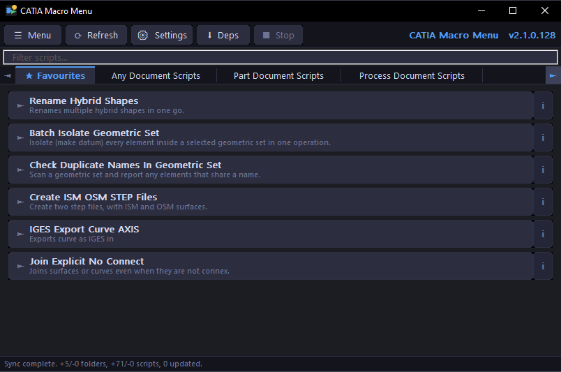
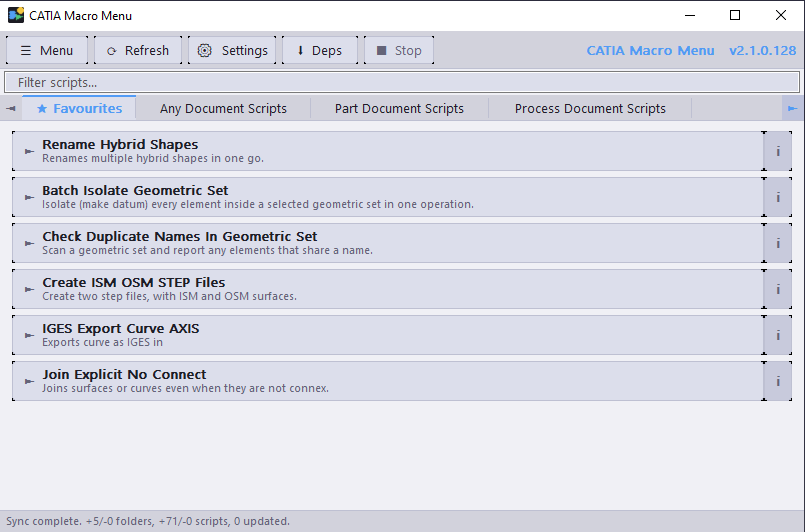

# User Guide

## Contents
- [Installation](#installation)
- [First Launch](#first-launch)
- [The Interface](#the-interface)
- [Running Scripts](#running-scripts)
- [Favourites](#favourites)
- [Search / Filter](#search--filter)
- [Script Details](#script-details)
- [Hiding Scripts](#hiding-scripts)
- [Script Notes](#script-notes)
- [Run with Arguments](#run-with-arguments)
- [Sorting Scripts](#sorting-scripts)
- [Settings](#settings)
- [Script Sources](#script-sources)
- [Update Dependencies](#update-dependencies)
- [Quick Launch Bar](#quick-launch-bar)
- [System Tray](#system-tray)
- [Themes](#themes)
- [GitHub Token](#github-token)
- [Keyboard Shortcuts](#keyboard-shortcuts)
- [Writing Your Own Scripts](#writing-your-own-scripts)
- [Troubleshooting](#troubleshooting)

---

## Installation

1. Download the latest `CatiaMenuWin32.exe` from the [releases page](https://github.com/KaiUR/CatiaMenuWin32/releases/latest)
2. Place the `.exe` anywhere on your machine — no installer required
3. Double-click to run

**Requirements:**
- Windows 10 or later
- **Python 3.9+** — install from [python.org](https://www.python.org/downloads/)
- **[PyCATIA](https://github.com/evereux/pycatia)** — install via `pip install pycatia` (or use **↓ Deps** in the app)
- **CATIA V5** — must be running for scripts that interact with it

---

## First Launch

On first launch the app will:

1. Create `%APPDATA%\CatiaMenuWin32\` to store settings and cached scripts
2. Attempt to auto-detect your Python installation
3. Sync scripts from the built-in `KaiUR/Pycatia_Scripts` repository
4. Display the scripts as clickable buttons organised by tab

If the sync fails with "Connect to internet to sync", check your internet connection. If you are on a corporate network see the [GitHub Token](#github-token) section.

---

## The Interface

```
┌──────────────────────────────────────────────────────────────────┐
│  CATIA Macro Menu                                      -  [ ]  x │
├──────────────────────────────────────────────────────────────────┤
│  [Menu] [Refresh] [Settings] [Deps] [Stop]          v2.1.0.128   │
├──────────────────────────────────────────────────────────────────┤
│  Filter scripts...                                               │
├──────────────────────────────────────────────────────────────────┤
│ <  * Favourites  |  Any Document Scripts  |  Part Doc Scripts  > │
├──────────────────────────────────────────────────────────────────┤
│  >  Rename Hybrid Shapes                                    [i]  │
│     Renames multiple hybrid shapes in one go.                    │
│  >  Batch Isolate Geometric Set                             [i]  │
│     Isolate every element in a geometric set as a datum.         │
│  >  Check Duplicate Names In Geometric Set                  [i]  │
│     Scan a geometric set for elements that share a name.         │
│                                                                  │
├──────────────────────────────────────────────────────────────────┤
│  Sync complete. +5/-0 folders, +71/-0 scripts, 0 updated.        │
└──────────────────────────────────────────────────────────────────┘
```

**Dark Mode**



**Light Mode**



**Toolbar buttons:**
- **☰ Menu** — access all app functions via dropdown menus
- **↺ Refresh** — re-sync scripts from all sources
- **⚙ Settings** — open the settings dialog
- **↓ Deps** — install/update Python dependencies
- **■ Stop** — terminate the currently running background script (grayed out when idle; red when active)

**Tab bar:**
- Each tab corresponds to a script folder
- Click a tab to switch between script categories
- When there are more tabs than fit, ◄ ► arrows appear — click or use the **mouse wheel** to scroll

**Script buttons:**
- Click the main area to run the script
- Click the **i** badge on the right to see script information (purpose, author, version, description)

---

## Running Scripts

Click any script button to run it. The app will:

1. Verify the script's SHA hash against GitHub to confirm it hasn't been tampered with
2. Launch Python with the script path
3. Show "Script launched in console" or the exit code in the status bar

**Console options** (configurable in Settings):
- **Show console** — opens a visible Python console window when the script runs
- **Keep console open** — keeps the console window open after the script finishes so you can read output and errors (`cmd /k` mode)

Without **Show console**, scripts run silently in the background.

### Stopping a Running Script

Click the **■ Stop** toolbar button to immediately terminate the running script. The button is grayed out when no script is running and turns red when one is active.

> **Note:** Only background (no-console) runs can be stopped this way. If **Show console** is enabled, close the console window directly, or press `Ctrl+C` inside it.

---

## Settings

Open via **☰ Menu → File → Settings...** or the **⚙ Settings** toolbar button.

The Settings dialog is organised into five tabs:

### General tab

| Option | Description |
|--------|-------------|
| **Python Interpreter** | Full path to `python.exe`. Click **Browse...** to locate it. Leave blank to auto-detect from PATH. |
| **Script Cache Folder** | Where downloaded scripts are stored locally. Defaults to `%APPDATA%\CatiaMenuWin32\scripts`. |
| **GitHub Token** | Optional Personal Access Token. Increases the API rate limit from 60 to 5,000 req/hr and is required for private repositories. Tick **Use token** and paste the token. See [GitHub Token](#github-token). |

### Sync tab

| Option | Default | Description |
|--------|---------|-------------|
| Sync scripts automatically on startup | On | Downloads latest scripts when the app starts |
| Always download latest before running | Off | Re-downloads the script every time before running |
| Check for app updates on startup | On | Notifies you when a newer version is available |
| Auto-install updates | On | Downloads and installs new versions automatically; also applies when triggering **Help → Check for Updates…** manually |
| Auto-refresh every N hours | 6 | Background sync interval in hours; 0 = disabled |

### Console tab

| Option | Default | Description |
|--------|---------|-------------|
| Show Python console window | Off | Opens a visible console when running scripts |
| Keep console open after script finishes | On | Window stays open so you can read output/errors (`cmd /k` mode) |
| Keep Update Deps console open | Off | Keeps the dependency install window open until you close it |

### Window tab

| Option | Default | Description |
|--------|---------|-------------|
| Always on Top | On | Keep the main window above other applications |
| Minimize to Tray | On | Hide to system tray instead of taskbar when minimised |
| Start with Windows | On | Launch automatically at login |
| Start Minimized | On | Start hidden in the tray |
| Theme | System | Dark, Light, or follow Windows setting |
| Sort Scripts | Default Order | Default, Alphabetical, By Date, or Most Used |

### Quick Bar tab

| Option | Default | Description |
|--------|---------|-------------|
| Enable Quick Launch Bar | On | Show the floating icon toolbar |
| Orientation | Vertical | Vertical (column) or Horizontal (row) |
| Stay on Top with Target App | On | Auto-elevate bar when target app is in the foreground |
| Target App | `CATIA V5` | Window-title substring to track; leave empty for always-visible bar |
| Target Exe | `CNEXT.exe` | Process executable filename to match alongside **Target App**. Click **Browse…** to pick the `.exe` from a file dialog instead of typing it. Leave empty to match any process. |

### Reset to Defaults
The **Reset to Defaults** button at the bottom left resets all settings to their original values. Your script sources (extra repos and local folders) are not affected.

---

## Script Sources

Open via **☰ Menu → File → Sources...**

CatiaMenuWin32 can load scripts from three types of sources simultaneously:

### Built-in Repository
The `KaiUR/Pycatia_Scripts` repository is the default primary source. If you want to use the app with your own scripts only — or as a general Python script launcher unrelated to CATIA — you can disable it:

1. Open **☰ Menu → File → Sources...**
2. At the top of the dialog, uncheck **Enable built-in repository (KaiUR/Pycatia_Scripts)**
3. Click **OK**
4. Click **↺ Refresh** — the built-in scripts are removed from all tabs immediately

The built-in repository is not deleted from your cache, just hidden. Re-check the box and refresh to restore it at any time.

### Additional GitHub Repositories
Add any GitHub repository that uses the same folder structure (subfolders contain `.py` files):

1. Click **Add...** under "Additional GitHub Repositories"
2. Enter the full URL: `https://github.com/owner/repo`
3. Enter the branch name (defaults to `main`)
4. Optionally add a token for private repos or higher rate limits
5. Click **OK**

If two repositories have a folder with the same name, their scripts are merged into one tab.

To **enable or disable** a repo without removing it, select it and click **Enable/Disable**.

To **remove** a repo, select it and click **Remove** — you will be asked to confirm and given the option to delete its cached files.

### Local Script Folders
Add a folder on your machine that contains subfolders with `.py` files:

```
My_Scripts/
├── Any_Document_Scripts/
│   └── my_script.py
└── Part_Document_Scripts/
    └── another_script.py
```

1. Click **Add...** under "Local Script Folders"
2. Browse to your folder and click OK

Local scripts run directly from disk — no downloading or SHA checking. A `setup/` subfolder is never shown as a tab — it is used for dependencies only.

### Update Dependencies for Sources
If a source has a `setup/requirements.txt` file, clicking **↓ Deps** will run `pip install --upgrade pip && pip install --upgrade -r requirements.txt` for each source separately in order:
1. Main repo requirements
2. Each extra GitHub repo's requirements
3. Each local folder's requirements

---

## Update Dependencies

Click **↓ Deps** (or **☰ Menu → Run → Update Dependencies**) to install Python packages required by the scripts.

The app runs `pip install --upgrade pip && pip install --upgrade -r requirements.txt` for each configured source that has a `setup/requirements.txt` file. Each source runs in its own console window sequentially.

Enable **Keep Update Deps console open** in Settings to keep each window visible until you close it manually.

---

## Quick Launch Bar

The Quick Launch Bar is a small floating button bar that gives you one-click access to your favourite scripts without switching to the main window.

### Enabling the bar

Go to **☰ Menu → View → Quick Bar → Enable Quick Bar**, or right-click the bar itself and tick **Enable Quick Bar**.

### Buttons

Each button represents one script from your ⭐ Favourites tab. The button face shows the first two uppercase letters of the script name. Hover over a button to see the full script name and its Purpose line in a tooltip. Click to run the script.

If you have more favourites than fit in the bar, **▲ ▼** (vertical) or **◄ ►** (horizontal) scroll arrows appear at the edges. You can also scroll with the **mouse wheel**.

### Moving the bar

Drag any empty area of the bar (between buttons) to reposition it anywhere on screen. The position is saved automatically to `settings.ini`.

### Orientation

Switch between vertical and horizontal layouts via **☰ Menu → View → Quick Bar** or the right-click context menu. The bar resizes automatically.

### Always on top with the target app

When **On Top with Target App** is enabled, the bar rises to always-on-top whenever the configured target application gains focus, and drops back to normal z-order when any other window comes to the front. This lets the bar float above your target app without covering unrelated windows.

The bar also tracks the target application's state:
- **Target app visible** — bar shown normally
- **All target windows minimised** — bar hides automatically and reappears when any window is restored
- **Target app not running** — bar hides automatically; it reappears when the app is launched and a visible window is detected

### Setting the target app

By default the target is **CATIA V5**. To use the bar with a different application:

1. Right-click the bar and select **Set Target App…** (or **☰ Menu → View → Quick Bar → Set Target App…**)
2. Enter any substring that appears in the target application's window title (e.g. `Fusion 360`, `Blender`, `SolidWorks`)
3. Optionally enter the **Target Exe** — the process executable filename (e.g. `CNEXT.exe`) — to prevent the bar from responding to other windows whose titles contain the same substring. Click **Browse…** to navigate to the executable with a file picker instead of typing the name manually
4. Click **OK**

To disable target tracking entirely — keeping the bar always visible with no topmost behaviour — clear both fields and click **OK**.

### Right-click menu options

| Option | Description |
|--------|-------------|
| Enable Quick Bar | Toggle the bar on or off |
| Horizontal / Vertical | Switch orientation |
| On Top with Target App | Toggle topmost-with-target behaviour (greyed out when no target is set) |
| Set Target App… | Enter the window-title substring to track |
| Reset Position | Move the bar back to its default position (right edge of screen) |

---

## System Tray

Enable **Minimize to Tray** in **☰ Menu → Window** to hide the window to the system tray instead of the taskbar when minimised or closed.

- **Double-click** the tray icon to restore the window
- **Right-click** the tray icon for a quick menu

Enable **Start with Windows** to launch the app automatically at login. Combine with **Start Minimized** to have it start silently in the tray.

---

## Themes

Switch between dark, light, and system-default themes via **☰ Menu → View → Theme**:

- **System (default)** — follows your Windows theme setting automatically
- **Dark** — always dark regardless of Windows setting
- **Light** — always light regardless of Windows setting

---

## GitHub Token

The app uses the GitHub REST API to fetch script lists. Without a token, GitHub allows **60 requests per hour per IP address**.

A token increases this to **5,000 requests per hour** and is required for private repositories.

**To create a token:**
1. Go to GitHub → Settings → Developer settings → Personal access tokens → Fine-grained tokens
2. Click **Generate new token**
3. Name it `CatiaMenuWin32`
4. Set expiry as preferred
5. Under Repository access select **Public Repositories (read-only)**
6. Click **Generate token** and copy it

**To add it to the app:**
1. Open **☰ Menu → File → Settings...**
2. Tick **Use token**
3. Paste the token
4. Click **OK**

> **Office / shared network users:** If multiple people share the same public IP address, all their requests count against the same 60/hour limit. Each user should set their own token to avoid seeing "Connect to internet to sync" errors.

---

## Writing Your Own Scripts

CatiaMenuWin32 reads metadata from a structured header block at the top of each `.py` file. This header powers the tooltip shown when you hover over the **i** badge on a script button.

### Header Format

```python
'''
    -----------------------------------------------------------------------------------------------------------------------
    Script name:    My_Script_Name.py
    Version:        1.0
    Code:           Python3.10.4, Pycatia 0.8.3
    Release:        V5R32
    Purpose:        One line summary shown under the script name in the button.
    Author:         Your Name
    Date:           DD.MM.YY
    Description:    Full description of what the script does. This is shown in the
                    tooltip popup. Continuation lines must be indented.
    dependencies = [
                    "pycatia",
                    ]
    requirements:   Python >= 3.10
                    pycatia
                    Catia V5 running with an open document.
    -----------------------------------------------------------------------------------------------------------------------

    Change:

    -----------------------------------------------------------------------------------------------------------------------
'''
```

### Rules
- The header must be inside a triple-quoted string `'''...'''` or `"""..."""` at the top of the file
- The dashed separator lines (`-----...`) mark the start and end of the header block
- Keys are matched case-insensitively: `Script name:`, `Purpose:`, `Author:`, `Date:`, `Version:`, `Description:`
- **Purpose** — shown as the subtitle line on the script button (keep it short, one line)
- **Description** — shown in the tooltip; continuation lines must be indented with spaces or tabs
- Parsing stops at the second dashed separator line, or at `dependencies`, `requirements`, `import`, `def`, or `class`
- If no metadata is found the script still appears as a button — just without tooltip details

### Folder Structure

Scripts must be organised in subfolders — the subfolder name becomes the tab name:

```
Your_Repo/
├── Any_Document_Scripts/
│   └── My_Script.py
├── Part_Document_Scripts/
│   └── Another_Script.py
└── setup/
    └── requirements.txt
```

Folder names use snake_case — the app converts them to title case automatically:
`Any_Document_Scripts` → `Any Document Scripts`

### PyCATIA

Scripts in `KaiUR/Pycatia_Scripts` use the [PyCATIA](https://github.com/evereux/pycatia) library by evereux for automating CATIA V5 via COM. To write your own scripts:

1. Install PyCATIA: `pip install pycatia`
2. See the [PyCATIA documentation](https://pycatia.readthedocs.io/) for the full API reference
3. CATIA V5 must be running before scripts that interact with it are executed

### Setup Folder

If your repository or local folder contains a `setup/` subfolder with a `requirements.txt`, clicking **↓ Deps** will automatically install those dependencies:

```
Your_Repo/
└── setup/
    └── requirements.txt
```

The `setup/` folder is never shown as a tab.

### Persistent Data

> **Never ask users to edit a script to change settings or parameters.** CatiaMenuWin32 verifies the SHA hash of every downloaded script against GitHub before running it. A script that has been locally modified will fail the integrity check and the app will refuse to run it. All user-configurable data must be stored outside the script file.

Store settings in a per-script folder under `%APPDATA%\pycatia_scripts\`:

```
%APPDATA%\pycatia_scripts\<Your_Script_Name>\user_settings.json
```

Use the script filename (without `.py`) as the folder name. This keeps each script's data isolated and easy to locate or clean up.

**Implementation pattern:**

```python
import os
import json

SETTINGS_DIR  = os.path.join(os.environ['APPDATA'], 'pycatia_scripts', 'Your_Script_Name')
SETTINGS_FILE = os.path.join(SETTINGS_DIR, 'user_settings.json')

# --- Load (in your dialog __init__) ---
hardcoded_defaults = {"my_param": "10.0", "another_param": "5.0"}
settings = hardcoded_defaults.copy()
if os.path.exists(SETTINGS_FILE):
    try:
        with open(SETTINGS_FILE, 'r') as f:
            settings.update(json.load(f))
    except:
        pass  # Fall back to hardcoded defaults on corrupt or missing file

# --- Save (after user clicks OK) ---
if not os.path.exists(SETTINGS_DIR):
    os.makedirs(SETTINGS_DIR)
with open(SETTINGS_FILE, 'w') as f:
    json.dump({"my_param": dlg.my_field.GetValue(), "another_param": dlg.other_field.GetValue()}, f, indent=4)
```

**Rules:**
- Always define `hardcoded_defaults` — these are factory defaults when no saved file exists
- Wrap the file read in `try/except` and fall back to defaults if the file is corrupt
- Create the directory before writing: use `os.makedirs()` after checking it does not exist
- Save only on successful completion (OK), not on cancel or error
- Include a **Clear Saved** button in dialogs that saves settings, so users can return to factory defaults without touching any files

---

## ⭐ Favourites

Favourites give you quick access to the scripts you use most often.

**To add a favourite:**
- Right-click any script button → **Add to Favourites**
- Or open **Script Details...** → tick the **Favourite** checkbox → click OK

A dedicated **⭐ Favourites** tab appears at the far left of the tab bar as soon as you have at least one favourite. It disappears automatically when all favourites are removed.

**To remove a favourite:**
- Right-click the script → **Remove from Favourites**
- Or open **Script Details...** → untick the **Favourite** checkbox → click OK

Favourites are also the source for the [Quick Launch Bar](#quick-launch-bar) — every script you favourite automatically appears as a button on the floating bar.

Favourites are stored in `%APPDATA%\CatiaMenuWin32\prefs.ini` and persist across restarts and syncs.

---

## 🔍 Search / Filter

A filter bar sits below the toolbar. Type any text to instantly filter the scripts in the current tab by name or purpose. Clear the box to show all scripts again.

---

## 📋 Script Details

Right-click any script button and select **Script Details...** to open a full details dialog showing:

- Script name, purpose, author, version, date
- Code environment and CATIA release
- Full description and requirements
- Local cache path
- Your personal note
- Favourite and Hidden toggles

Changes to the note, favourite, and hidden state are saved when you click OK.

---

## 🙈 Hiding Scripts

Hiding a script removes it from view without deleting it from the cache.

**To hide a script:**
- Right-click any script → **Hide Script**
- Or open **Script Details...** → tick the **Hidden** checkbox → click OK

Hidden scripts are not deleted — they remain in the cache and will not reappear after a sync. If every script in a tab is hidden, the tab itself disappears from the tab bar automatically.

**To unhide scripts:**
1. Go to **☰ Menu → File → Manage Hidden Scripts**
2. Select one or more scripts from the list
3. Click **Unhide** to restore the selected scripts, or **Unhide All** to restore everything

The tab reappears automatically as soon as any script in it is unhidden.

---

## 📝 Script Notes

Right-click any script → **Add Note...** (or **Edit Note...**) to attach a personal note to a script. Notes are visible in the Script Details dialog and stored in `prefs.ini`.

---

## ▶️ Run with Arguments

Right-click any script → **Run with Arguments...** to pass custom command line arguments when running the script.

---

## 🔢 Sorting Scripts

**☰ Menu → View → Sort Scripts** offers four sort modes:

| Mode | Description |
|------|-------------|
| Default Order | Order from GitHub API or disk |
| Alphabetical | A–Z by script name |
| By Date | Most recent scripts first (from script header Date field) |
| Most Used | Scripts you run most often appear first |

The sort mode is saved in Settings and applied to all tabs.

---

## ❓ In-App Help

Press **F1** or go to **☰ Menu → Help → Help Contents** to open the built-in help window.

The help window has a table of contents on the left and formatted topic content on the right. Click any topic to navigate to it. The window is resizable and stays open while you work.

---

## ⌨️ Keyboard Shortcuts

| Shortcut | Action |
|----------|--------|
| `F1` | Open Help |
| `F5` | Refresh + Sync |
| `F9` | Run last script |
| `Ctrl+Tab` | Next tab |
| `Ctrl+Shift+Tab` | Previous tab |

---

---

## Troubleshooting

### "Connect to internet to sync"
- Check your internet connection
- You may have hit the GitHub API rate limit — set a token (see [GitHub Token](#github-token))
- Corporate firewalls may block `api.github.com` — contact your IT department

### Script fails with "Python Not Found"
- Open **☰ Menu → File → Settings...**
- Click **Browse...** next to Python Interpreter and locate `python.exe`

### SHA mismatch warning
- The local cached script differs from what GitHub expects
- Click **Yes** when prompted to re-download the script
- If it persists, delete the cache folder in Settings and re-sync

### Update prompt on local builds
- Local builds pick up the latest release tag via git
- Pull the latest tags with `git fetch --tags` and rebuild
- The local build number will be one higher than the release and no prompt will appear

### A script has disappeared
- It may have been hidden — check **☰ Menu → File → Manage Hidden Scripts**
- If using a filter, clear the search box

### Scripts don't appear after adding a source
- Click **↺ Refresh** to trigger a sync with the new source
- Check the Sources dialog to confirm the source is enabled
